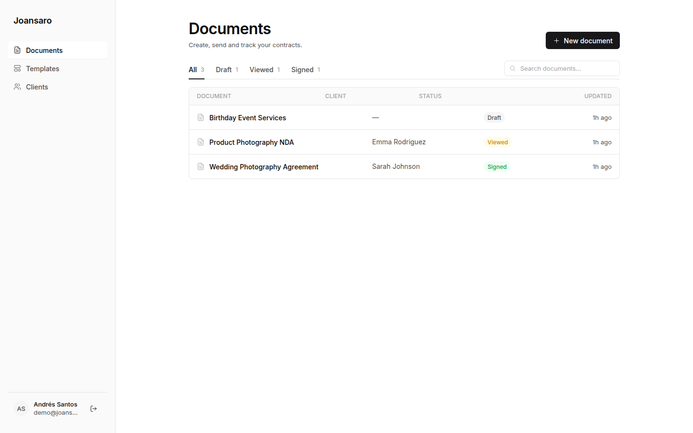
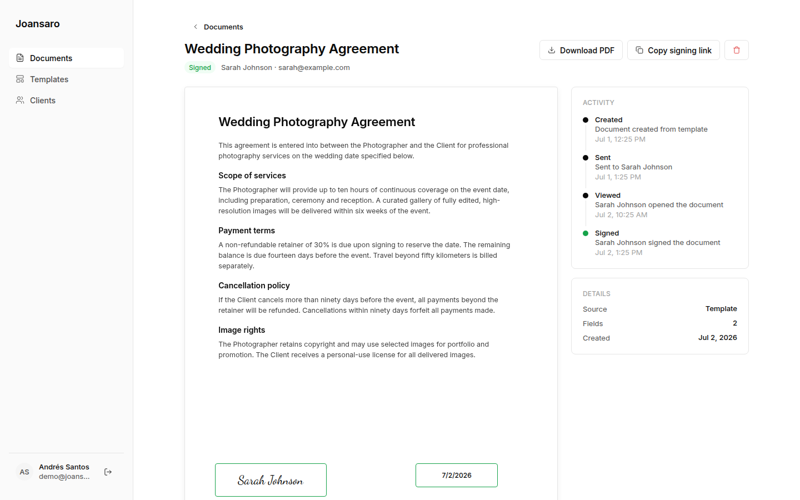
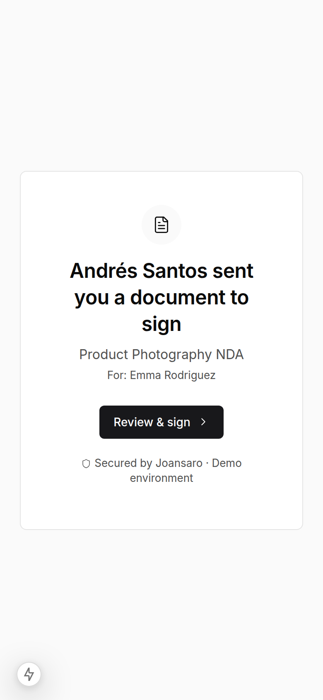

<h1 align="center">✍️ Joansaro Contratos</h1>

<p align="center"><strong>Contract e-signature platform — visual field editor, digital signatures and certified PDFs.</strong></p>

<p align="center">
  
  
  
  
  
</p>

<p align="center">
  
</p>

## ✨ What's inside

- 📝 **Document builder** — create contracts from templates, drop signature/text/date fields onto the page and assign them to signers.
- 🖊️ **Digital signature flow** — each signer gets their own link, draws or types their signature, and the document state advances (draft → viewed → signed).
- 📄 **Certified PDF output** — final documents are rendered with `pdf-lib` (+ custom fonts via fontkit) and stamped with a signature certificate page.
- ⚡ **Next.js 15 App Router end to end** — Server Components + Server Actions, no separate API layer needed.
- 🗃️ **Prisma + SQLite** — zero-config persistence, seedable for a working demo out of the box.

## 🚀 Quick start

> Requires Node 20+.

```bash
npm install
npm run db:push     # create the SQLite schema
npm run db:seed     # demo data
npm run dev         # http://localhost:3000
```

## 📸 Screens

| Field editor | Mobile |
|---|---|
|  |  |

---

<p align="center">Built by <a href="https://github.com/joansaro">Andrés Santos</a> · <a href="https://joansaro.com">joansaro.com</a></p>
